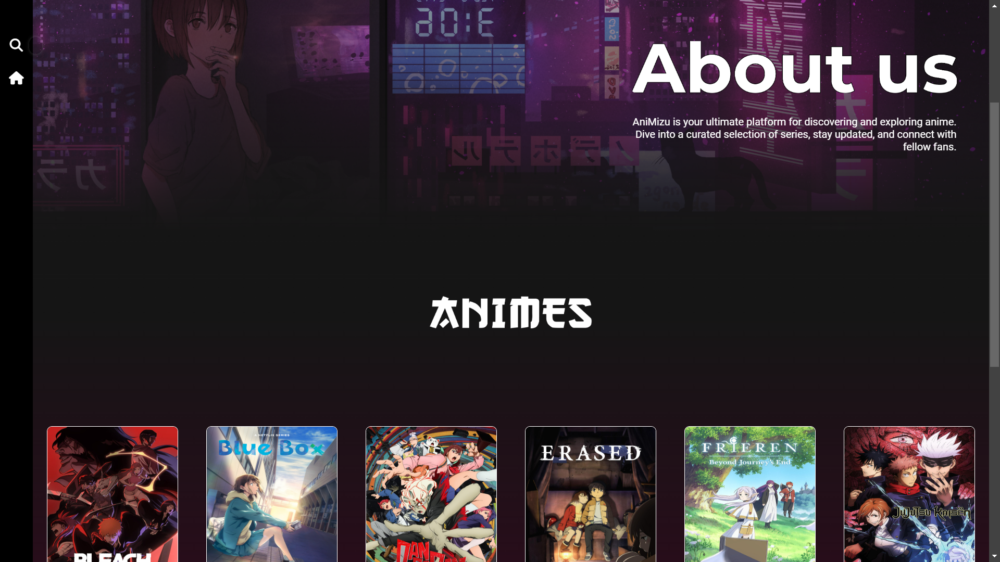
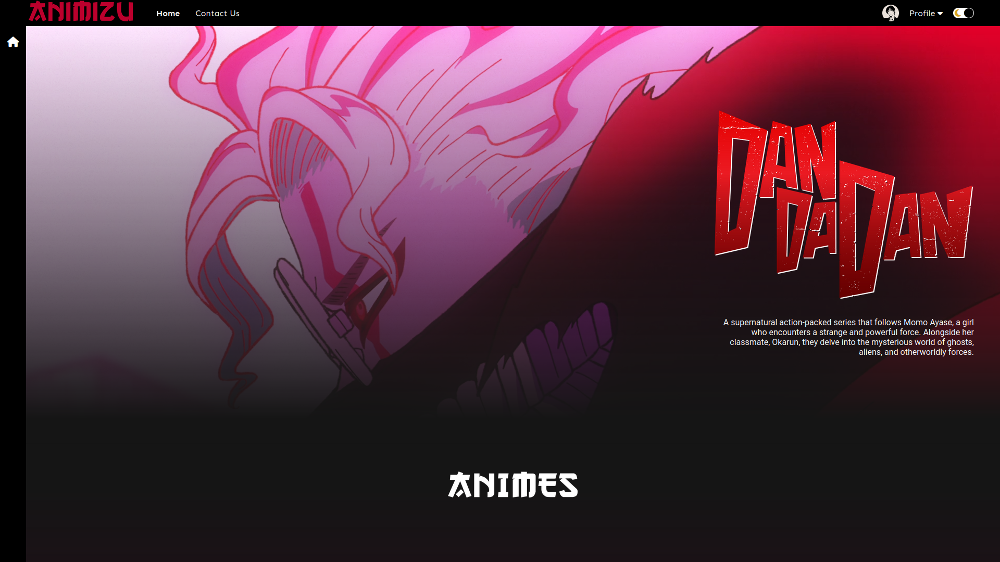

<!-- PROJECT TITLE -->
 

  <h2 align="center"></h2>

  

    Your go-to anime database! 🌸
     
    <a href="https://github.com/chai-enjoyer/watchatori"><strong>Explore the docs »</strong></a>
     
     
  

<!-- TABLE OF CONTENTS -->

  
🗂️ Table of Contents

  <ol>
    <li><a href="#about-the-project">📖 About The Project</a></li>
    <li><a href="#screenshots">📸 Screenshots</a></li>
    <li><a href="#group-members">👥 Group Members</a></li>
    <li><a href="#contributing">🤝 Contributing</a></li>
  </ol>

<!-- ABOUT THE PROJECT -->
## About The Project

AniMizu is a web-based anime database designed to offer a clean and intuitive experience for anime enthusiasts. Developed using only HTML, CSS, and JavaScript, it showcases the power of barebones web development. 🌐

> **Note**
> This project is currently in development. We’re excited to add more features soon! 💻

(<a href="#readme-top">back to top</a>)

<!-- SCREENSHOTS -->
## Screenshots

  
   
  <i>Main interface screenshot</i>

  
   
  <i>Title page</i>

(<a href="#readme-top">back to top</a>)

<!-- GROUP MEMBERS -->
## Group Members

This project is collaboratively developed by:
- **Serik Nurtas** 🎨
- **Tursumbekov Batyrkhan** 🧑‍💻
- **Zhumabay Omar** 🔧

Together, we’re building a platform to bring anime lovers the information they need in one place! 🌟

(<a href="#readme-top">back to top</a>)

<!-- CONTRIBUTING -->
## Contributing

As of now, contributions are limited to the project team. If you have any feedback, ideas, or suggestions, feel free to reach out to one of the group members directly. We’d love to hear from you! 😊

(<a href="#readme-top">back to top</a>)
